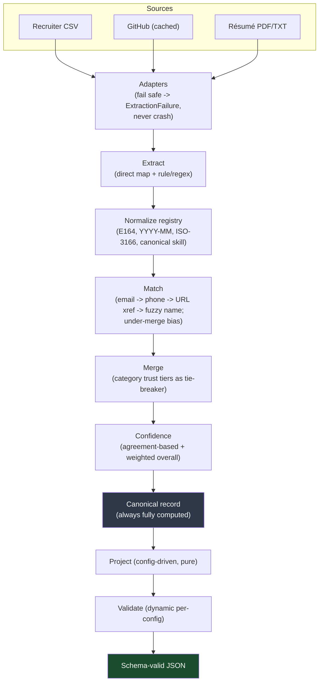

# Multi-Source Candidate Data Transformer

**Eightfold Engineering Intern Assignment (Jul–Dec 2026)**

Turns messy, overlapping candidate data from many sources into **one clean, canonical, explainable profile per candidate** — deduplicated across sources, normalized to fixed formats, with every field traceable to where it came from and how confident we are in it.

> **Core principle driving every design decision:** a wrong-but-confident value is worse than an honest null. The pipeline never invents data. When it isn't sure, it says so.

---

## Table of Contents

1. [Features](#1-features)
2. [Prerequisites](#2-prerequisites)
3. [Installation](#3-installation)
4. [Usage](#4-usage)
5. [Running on your own data](#5-running-on-your-own-data)
6. [What it produces](#6-what-it-produces)
7. [Canonical schema](#7-canonical-schema)
8. [Configurable output (the runtime config)](#8-configurable-output-the-runtime-config)
9. [Architecture & pipeline](#9-architecture--pipeline)
10. [Repository structure](#10-repository-structure)
11. [Testing](#11-testing)
12. [Assumptions & deliberate scope cuts](#12-assumptions--deliberate-scope-cuts)

---

## 1. Features

- **Multi-source ingestion** — recruiter CSV (structured) + GitHub profiles and résumé PDF/TXT (unstructured), each behind a fail-safe adapter.
- **Normalization** — phones → E.164, dates → `YYYY-MM`, country → ISO-3166 alpha-2, skills → canonical names.
- **Cross-source dedup & merge** — tiered matching (email → phone → GitHub URL cross-reference → fuzzy name) with an **under-merge bias**.
- **Provenance & confidence** — every field records its source(s) and method; confidence is agreement-based; an overall score is weighted by field importance.
- **Configurable output** — a runtime config reshapes the output (select / rename / normalize / toggle / missing-value policy) with **no code changes**, validated against a schema built from that config.
- **Two CLI modes** — an interactive prompt flow (incl. a live config builder) and a flag-based mode for scripting.
- **Deterministic & robust** — same inputs produce the same output; a missing or garbage source degrades gracefully instead of crashing.
- **Tested** — 88 automated tests, including an image-only-PDF gold edge case.

---

## 2. Prerequisites

- **Python 3.11 or newer** (developed on 3.12)
- **pip** (bundled with Python)
- **git** (to clone the repository)

No database, web server, or API keys are required. The only optional network call is fetching a live GitHub profile (see [§5](#5-running-on-your-own-data)); the bundled sample runs fully offline.

---

## 3. Installation

```bash
# 1. Clone
git clone https://github.com/naveenkailash27/candidate-data-transformer.git
cd candidate-data-transformer

# 2. (Recommended) create and activate a virtual environment
python -m venv .venv
# Windows (PowerShell):
.venv\Scripts\Activate.ps1
# macOS / Linux:
source .venv/bin/activate

# 3. Install dependencies
python -m pip install -r requirements.txt
```

**Dependencies** (installed by the step above): `pydantic` (schema/validation), `phonenumbers` (E.164), `python-dateutil` (dates), `rapidfuzz` (fuzzy name match), `pdfplumber` (résumé PDF text), `requests` (GitHub fetch helper), `reportlab` (sample-PDF generation), `pytest` (tests).

---

## 4. Usage

The entry point is `cli.py`. It reads a folder of source files, merges them into canonical profiles, optionally reshapes them with a config, and prints or writes schema-valid JSON.

### 4.1 Interactive mode (recommended for a first run)

Run with **no arguments** and answer the prompts. It even lets you **build a runtime config live** — pick fields and choose missing-value behavior without editing any file:

```bash
python cli.py
```

```text
=== Candidate Data Transformer (interactive) ===
Inputs folder [sample_inputs]:            ← press Enter for the demo data
Output shape:
  1. Default schema (full canonical profile)
  2. Load a config file
  3. Build a runtime config now (no file needed)
Pick [1]: 3
Include which fields? (comma numbers, or 'a' for all) [a]: 2,3,4,9
On missing value:  1) null   2) omit   3) error   [1]: 2
Include provenance? [y/N]: y
Include confidence? [y/N]: y
Reference date YYYY-MM-DD [today]:
Write to file (path) or leave blank to print:
...prints the reshaped JSON...
```

### 4.2 Flag mode (for scripting / reproducible output)

```bash
# Default canonical schema (all fields), written to a file
python cli.py --inputs sample_inputs --out output/profiles.json --reference 2026-06-30

# Custom config (subset / rename / normalize / on_missing) — same engine, no code change
python cli.py --inputs sample_inputs --config config/example_config.json --out output/custom_profiles.json --reference 2026-06-30
```

| Flag | Meaning |
|---|---|
| `--inputs <dir>` | Directory containing the source files (see [§5](#5-running-on-your-own-data)). If omitted, the CLI starts in interactive mode. |
| `--config <file>` | Projection config JSON. Omit to emit the full default schema. |
| `--out <file>` | Output path. Prints to stdout if omitted. |
| `--reference <YYYY-MM-DD>` | Anchor date for ongoing-role math (e.g. "Present"), making output fully deterministic. Defaults to today. |
| `-i`, `--interactive` | Force interactive mode. |

**Exit codes:** `0` success · `1` inputs folder not found · `2` config error (bad path/type/normalizer).

Skipped sources and per-candidate projection errors are reported on **stderr** — they never silently disappear and never crash the run.

---

## 5. Running on your own data

Point `--inputs` at any folder. The CLI auto-discovers these inside it:

| Source | Group | Location in the folder |
|---|---|---|
| Recruiter CSV | structured | `*.csv` (columns: `name, email, phone, current_company, title`) |
| GitHub profiles | unstructured | `github_urls.txt` (one URL per line) + a cached `github/<login>.json` per profile |
| Résumés | unstructured | `resumes/*.pdf` or `resumes/*.txt` |

Anything missing is simply skipped. A minimal folder can contain just one source.

**To turn a live GitHub profile into the cached fixture** the adapter expects:

```bash
python scripts/fetch_github.py <github-username> <your-inputs-folder>
# e.g. python scripts/fetch_github.py octocat my_inputs
```

This writes `my_inputs/github/<login>.json` and appends the URL to `my_inputs/github_urls.txt`. (Fixtures are cached so runs stay deterministic and tests stay offline.)

> Tip: keep personal data out of version control by using a folder that is git-ignored.

---

## 6. What it produces

`output/profiles.json` (default schema) and `output/custom_profiles.json` (example config) are committed so you can inspect real output without running anything.

The three bundled sample candidates each exercise a different path:

| Candidate | Demonstrates |
|---|---|
| **Jane Doe** | Merged across all 3 sources by email; phone normalized to E.164 using the country from her *GitHub* location (cross-source dependency); skills agreed by GitHub + résumé score higher (`0.85`) than single-source ones (`0.70`); `years_experience` via interval-merge; education from résumé. |
| **John Smith** | No email anywhere → merged by **fuzzy name + shared company**; an unrecognized skill (`wizardry`) is preserved in `unmatched_skills`; lower confidence for the missing required email. |
| **Priya Patel** | Single source; an unparseable phone (`not-a-number`) becomes **null**, not a guess. |

Example custom-config output for Jane (same engine, reshaped):

```json
{
  "full_name": "Jane Doe",
  "primary_email": "jane.doe@gmail.com",
  "phone": "+14155552671",
  "country": "US",
  "skills": ["Docker", "Go", "JavaScript", "Kubernetes", "PostgreSQL", "Python"],
  "overall_confidence": 0.83
}
```

With that config, John is **excluded** and reported on stderr because it marks `primary_email` as `required` and he has none — an honest, loud failure rather than a fabricated email.

---

## 7. Canonical schema

```
candidate_id        string                          # stable hash of identity
full_name           string | null
emails              string[]
phones              string[]                         # E.164
location            { city, region, country }        # country: ISO-3166 alpha-2
links               { linkedin, github, portfolio, other[] }
headline            string | null
years_experience    number | null                    # interval-merged calendar span
skills              [{ name, confidence, sources[], method }]
unmatched_skills    [{ raw_text, sources[], confidence }]
experience          [{ company, title, start, end, summary, ongoing }]   # dates: YYYY-MM
education           [{ institution, degree, field, end_year }]
provenance          [{ field, source[], method }]
overall_confidence  number
```

Provenance `method` vocabulary (fixed): `direct_mapping`, `regex_extraction`, `merged_agreement`, `merged_conflict_resolved`, `normalized`, `inferred_fallback`, `unmatched_passthrough`, `interval_merge`, `flagged_malformed`.

---

## 8. Configurable output (the runtime config)

A JSON config reshapes the output with no code change. Example (`config/example_config.json`):

```json
{
  "fields": [
    { "path": "full_name", "type": "string", "required": true },
    { "path": "primary_email", "from": "emails[0]", "type": "string", "required": true },
    { "path": "phone", "from": "phones[0]", "type": "string", "normalize": "E164" },
    { "path": "country", "from": "location.country", "type": "string" },
    { "path": "skills", "from": "skills[].name", "type": "string[]", "normalize": "canonical" }
  ],
  "include_confidence": true,
  "include_provenance": false,
  "on_missing": "null"
}
```

| Capability | How |
|---|---|
| **Select a subset** | the `fields` list |
| **Rename / remap** | `path` = output key, `from` = canonical source path |
| **Path resolution** | dot notation, `[n]` indexing, `[].field` array-mapping. An unknown field / malformed path is a **config error** (loud); a valid path that resolves to nothing applies `on_missing`. |
| **Per-field normalize** | `"normalize": "E164"` / `"canonical"` / … (same registry the engine uses) |
| **Toggle metadata** | `include_confidence`, `include_provenance` |
| **Missing-value policy** | `on_missing`: `null` (key = null) / `omit` (drop key) / `error` (fail loudly). Required fields always error when missing. |
| **Validation** | the projected result is checked against a validator **built dynamically from the config** (types + required-ness) before return. |

The same options are available through the interactive **config builder** ([§4.1](#41-interactive-mode-recommended-for-a-first-run)) — no file needed.

---

## 9. Architecture & pipeline



**Key architectural split:** the canonical record is always computed in full; the projection layer is a pure, stateless transform on top of it. The config controls what's *shown*, never what's *computed*.

### Design decisions worth calling out

- **Normalization.** Dates → `YYYY-MM` (year-only anchored to January; `"Present"` resolved only at calculation time). Phones → E.164 with a country fallback chain — **no country signal anywhere → null, never a guessed region**. Country → ISO-3166 alpha-2. Skills → canonicalized; unrecognized terms preserved in `unmatched_skills[]`, never dropped. Ordering matters: location resolves before phone, dates before `years_experience`.
- **Matching is under-merge biased.** Tiers, in order: exact email → exact phone → GitHub URL/handle cross-reference (so a résumé that lists a GitHub URL merges with that GitHub record) → fuzzy name + corroborating signal. Fuzzy matching never fuses two records from the same source. Two records for one person is recoverable; fusing two people is silent, unrecoverable corruption — strictly worse.
- **Merge uses trust tiers only as a tie-breaker**, and tiers are field-category-specific (CSV/ATS for contact, GitHub for skills, résumé/LinkedIn for education) — no single global source ranking.
- **Confidence is agreement-based, not count-based.** It rises when independent sources agree, drops on conflict, and a single clean source gets a fair baseline. `overall_confidence` is weighted (name/email matter most) and **penalizes** null required fields.
- **`years_experience` is interval-merged** (calendar-span union), so concurrent roles aren't double-counted; reversed/garbled ranges are flagged, not silently miscomputed.
- **Résumé parsing is deterministic & rule-based** — ALL-CAPS section detection, category-aware skill splitting, `Mon YYYY` / `MM/YYYY` dates, Unicode dash/bullet normalization, multi-line role layouts.
- **No LLM extraction** — it would break the determinism requirement. All extraction is rule-based/regex/library.

---

## 10. Repository structure

```
candidate-data-transformer/
├── candidate_transformer/
│   ├── models.py              # canonical pydantic schema
│   ├── adapters/              # csv, github, resume + ExtractionFailure contract
│   ├── normalize/             # registry: phone, dates, country, skills (+ taxonomy)
│   ├── merge/                 # tiered match + field merge
│   ├── confidence/            # agreement-based scoring
│   ├── project/               # projector (path resolver) + dynamic validator + config
│   └── pipeline.py            # orchestration
├── cli.py                     # entry point (interactive + flag modes)
├── config/
│   └── example_config.json    # sample projection config
├── sample_inputs/             # recruiter.csv, github_urls.txt, github/, resumes/
├── output/                    # produced sample output (committed)
├── scripts/
│   ├── make_sample_resume.py  # generate the sample résumé PDF (reportlab)
│   └── fetch_github.py        # turn a live GitHub profile into a cached fixture
├── tests/                     # 88 tests
└── requirements.txt
```

---

## 11. Testing

```bash
python -m pytest -q
```

**88 tests** covering: each normalizer (phone fallback chain, date edge cases, skill taxonomy); the match tiers (email, fuzzy-name, GitHub cross-reference, deliberate non-merge); interval-merge math (overlap, ongoing, malformed range); config projection (subset, rename via `from`, `on_missing` = null/omit/error, path errors); a dense real-world résumé (categorized skills, `MM/YYYY` dates, ALL-CAPS headers); the interactive CLI (default, load-file, live builder); graceful degradation; and the **image-only PDF → graceful null** gold edge case.

---

## 12. Assumptions & deliberate scope cuts

- **LLM extraction excluded** — would break determinism (same input must always yield same output). Replaced with rule-based/regex/library extraction.
- **GitHub uses cached fixtures**, not a live API call at pipeline time, to keep runs deterministic and tests offline. `scripts/fetch_github.py` produces the fixture from the live API; the same adapter consumes it.
- **ATS JSON and LinkedIn descoped** — only one source per group is required, and both groups are covered (CSV; GitHub + résumé). LinkedIn has no legitimate access path, so it is noted rather than scraped.
- **Identity conflict with no cross-reference** — different emails across sources, no phone overlap, and no GitHub URL mentioned anywhere → produced as two separate records, by design (under-merge bias).
- **Skills taxonomy is a bundled starter set**, not exhaustive. Coverage gaps are accepted; unmatched terms are preserved in `unmatched_skills[]`, never discarded.
- **Résumé parsing is best-effort** — real-world layouts vary widely, so extraction is honest about misses rather than guessing.
- **Large-scale performance** — matching uses hash-bucketing + name-token blocking to avoid O(n²) and is designed to scale to thousands, but is not benchmarked within this timeline.
