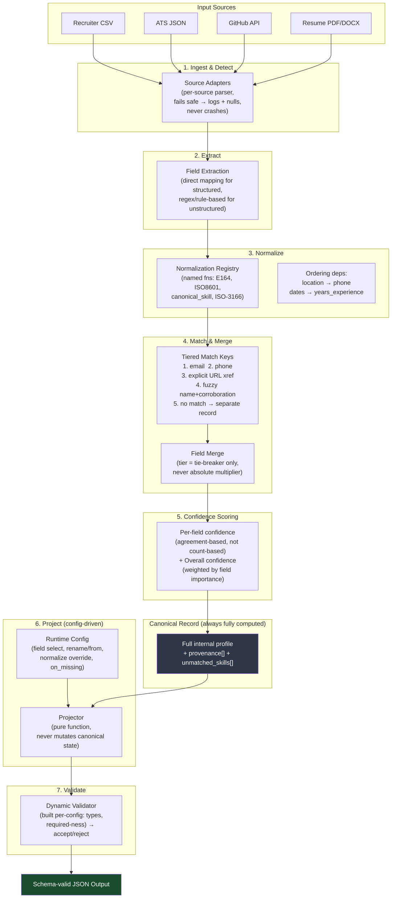

# Multi-Source Candidate Data Transformer

**Eightfold Engineering Intern Assignment (Jul–Dec 2026)**

> **Status note:** This README documents the target architecture before implementation begins. It is the contract the code is being built against — every module, function name, and flow described here reflects the locked design, not yet-written code. File/module names may shift slightly during implementation; the pipeline stages, data contracts, and policies will not.

---

## 1. What This Is

Eightfold ingests candidate data from many sources at once — recruiter CSVs, ATS systems, GitHub, LinkedIn, resumes, recruiter notes. The same candidate can appear in several sources with conflicting, missing, or malformed values. This project turns that mess into **one clean, canonical, explainable profile per candidate** — every field traceable to a source and a method, every uncertainty expressed as confidence rather than hidden.

**Core principle driving every design decision below:** a wrong-but-confident value is worse than an honest null. The pipeline never invents data. When it isn't sure, it says so.

---

## 2. Architecture Overview



---

## 3. Pipeline Stages — Detailed Breakdown

### 3.1 Ingest & Detect
Each source type has a dedicated **adapter** (`adapters/csv_adapter.py`, `adapters/ats_adapter.py`, `adapters/github_adapter.py`, `adapters/resume_adapter.py`). An adapter's job is narrow: read the raw source, catch any failure (missing file, malformed JSON, unreachable API, unparseable PDF), and emit either a raw fragment or an explicit `ExtractionFailure` marker — **never an unhandled exception**. A failed source degrades gracefully; it does not halt the run.

### 3.2 Extract
Structured sources (CSV, ATS) use direct field mapping — including a translation table for ATS's mismatched field names. Unstructured sources use **deterministic, rule-based extraction** — regex patterns for emails/phones, structured GitHub API fields (name, bio, repos, languages — directly typed, no parsing needed), and PDF text extraction (via `pdfplumber`/`pdfminer`) followed by rule-based section detection for resumes (experience blocks, education blocks, skills lists).

**LLM-based extraction is explicitly not used** — it breaks the "same input → same output" determinism constraint required by the assignment. This is a deliberate, documented tradeoff (see Section 7).

### 3.3 Normalize
A **normalizer registry** — a dict of named, swappable functions — is the single source of truth for all format transforms:

| Normalizer name | Applies to | Behavior |
|---|---|---|
| `E164` | phones | Fallback chain: explicit country code in raw string → resolved `location.country` → work-experience location text → null if no signal |
| `ISO8601` / date parser | experience/education dates | YYYY-MM; year-only anchored to January; `"Present"` resolved to current month only at calculation time, never frozen into storage |
| `ISO3166` | location.country | Maps free-text country mentions to alpha-2 codes |
| `canonical_skill` | skills | Maps raw skill strings against an existing skills taxonomy/library; unmatched terms routed to `unmatched_skills[]`, never dropped, never merged into the clean array |

**Explicit ordering dependencies** (must run in this order, not in parallel):
`location normalization → phone normalization` (phone needs a resolved country)
`date normalization → years_experience calculation` (interval math needs clean dates first)

### 3.4 Match & Merge
Determining whether two source records describe the same person uses a **tiered match strategy**, tried in priority order:

1. Exact email match (normalized, case-insensitive)
2. Exact phone match (post-E.164)
3. Explicit URL/handle cross-reference (e.g. a GitHub URL found inside resume/LinkedIn text)
4. Fuzzy name + corroborating signal (same company/title) — flagged `matched_by: "name_fuzzy"`, lowest-trust tier
5. No match → kept as a **separate candidate record**

**Design bias: under-merge, never over-merge.** Two duplicate records for the same person is a recoverable inconvenience. One record wrongly combining two different people's data is a silent, unrecoverable corruption — strictly worse, in line with the "wrong-but-confident is worse than empty" principle.

Once matched, fields are merged using **trust tiers as a tie-breaker only** — never an absolute confidence multiplier. Tiers are field-category-specific (e.g. ATS/CSV trusted for contact fields; GitHub trusted for technical/skill signal; LinkedIn/Resume trusted for education) — there is no single global source ranking.

### 3.5 Confidence Scoring
Per-field confidence is **agreement-based, not source-count-based** — a candidate with more available sources does not automatically score higher; a candidate with one clean, internally-consistent source is not penalized for lacking others. Confidence rises when independent sources agree, falls when sources conflict or normalization fails outright, and a single-source field gets a fair baseline regardless of which tier that source belongs to.

`overall_confidence` is a weighted aggregate (not a flat average) — required/high-importance fields (name, email) weigh more than optional ones (portfolio link), and null required fields are penalized rather than silently excluded from the average.

`years_experience` uses **interval-merge (calendar-span)**, not cumulative summation — overlapping roles are merged into non-overlapping intervals before summing, so a side/freelance role running concurrently with full-time employment doesn't inflate total experience. Malformed ranges (end before start, missing markers) are flagged for low confidence rather than silently miscomputed.

### 3.6 Project (Runtime Config)
The canonical record is **always fully computed**, regardless of what the config asks for — the config only controls what's *shown*, never what's *computed*. This keeps the canonical record deterministic and the projection layer a pure, stateless transform on top of it.

The projector supports:
- **Field selection** — filter by requested `path` list
- **Renaming/remapping** — a minimal custom path resolver supporting dot notation, `[n]` indexing, and `[].field` array-mapping (e.g. `skills[].name`). Distinguishes a malformed/unknown path (config error) from a valid path that resolves to nothing (`on_missing` policy applies)
- **Per-field normalization override** — same registry from Section 3.3, referenced by name string in config; adding a new format means adding a registry entry, not touching pipeline logic
- **Provenance/confidence toggle** — boolean flag, attach or strip
- **`on_missing` policy** — `null` (include key as null) / `omit` (drop key) / `error` (fail the whole projection loudly, naming the missing required field)

### 3.7 Validate
The projected output is checked against a **validator built dynamically from the config's field list** (types, required-ness) — not a single fixed validator, since required fields and types change per request. Validation is a separate gate after projection: it accepts or rejects, never mutates.

---

## 4. Canonical Schema

```
candidate_id: string
full_name: string | null
emails: string[]
phones: string[]                      # E.164
location: { city, region, country }   # country: ISO-3166 alpha-2
links: { linkedin, github, portfolio, other[] }
headline: string | null
years_experience: number | null       # interval-merged, calendar-span
skills: [{ name, confidence, sources[], method }]
unmatched_skills: [{ raw_text, sources[], confidence }]
experience: [{ company, title, start, end, summary, ongoing }]   # dates: YYYY-MM
education: [{ institution, degree, field, end_year }]
provenance: [{ field, source[], method }]
overall_confidence: number
```

**Provenance method vocabulary** (fixed, not open-ended):
`direct_mapping`, `regex_extraction`, `merged_agreement`, `merged_conflict_resolved`, `normalized_<type>`, `inferred_fallback`, `unmatched_passthrough`, `interval_merge`, `flagged_malformed`

---

## 5. Repository Structure (planned)

```
candidate-transformer/
├── adapters/
│   ├── csv_adapter.py
│   ├── ats_adapter.py
│   ├── github_adapter.py
│   └── resume_adapter.py
├── normalize/
│   ├── registry.py          # the normalizer dict
│   ├── phone.py
│   ├── dates.py
│   └── skills.py
├── merge/
│   ├── match.py              # tiered match key logic
│   └── merge.py               # field-level merge + tier tie-breaking
├── confidence/
│   └── scorer.py
├── project/
│   ├── projector.py           # path resolver + on_missing logic
│   └── validator.py           # dynamic per-config validator
├── pipeline.py                # orchestrates all stages in order
├── cli.py                     # entry point
├── config/
│   └── example_config.json
├── sample_inputs/
├── tests/
└── README.md
```

---

## 6. How to Run (planned CLI contract)

```bash
# Default schema, all sources
python cli.py --inputs sample_inputs/ --out output/profiles.json

# Custom config (subset/rename/normalize override)
python cli.py --inputs sample_inputs/ --config config/example_config.json --out output/custom_profiles.json
```

`--inputs` points to a directory containing any mix of CSV, ATS JSON, resume files, and a GitHub URL list. Missing or malformed files in that directory degrade gracefully — they do not stop the run for other candidates.

---

## 7. Known Limitations & Deliberate Scope Cuts

- **LLM-based extraction excluded** — would break the determinism requirement (same input must always yield same output). Replaced entirely with rule-based/regex/library extraction.
- **Identity conflict with no cross-reference** — if a candidate uses different emails across sources (e.g. resume email ≠ GitHub email) with no phone overlap and no GitHub URL mentioned anywhere in the resume/LinkedIn text, the system cannot merge them. They are produced as two separate candidate records. This is a documented limitation, not a bug — consistent with the under-merge-over-over-merge bias.
- **Custom skills taxonomy not built from scratch** — an existing library/dataset is used instead, under time constraints. Coverage gaps are accepted; unmatched terms are preserved in `unmatched_skills[]`, not discarded.
- **LinkedIn scraping** — used only if an official API/legitimate access path is available; otherwise descoped, noted as an assumption.
- **Large-scale performance tuning** — the architecture is designed to scale to thousands of candidates but is not benchmarked or optimized within this timeline.

---

## 8. Tests (planned)

- Unit tests per normalizer (phone fallback chain, date edge cases, skill taxonomy passthrough)
- Merge/match key tests (email match, fuzzy-name fallback, deliberate non-merge case)
- One gold-profile comparison test covering an edge case (image-based resume PDF → graceful null degradation)
- Config projection tests (field subset, rename via `from`, `on_missing` = error/omit/null)
