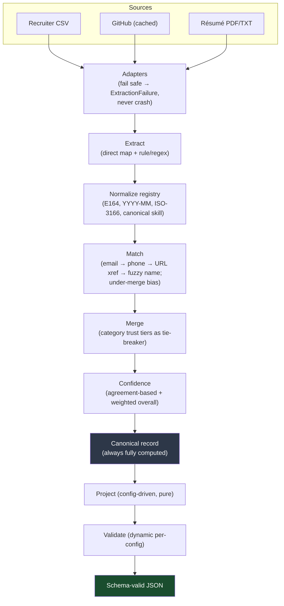

# Multi-Source Candidate Data Transformer

**Eightfold Engineering Intern Assignment (Jul–Dec 2026)**

Turns messy, overlapping candidate data from many sources into **one clean, canonical, explainable profile per candidate** — every field traceable to a source and a method, every uncertainty expressed as confidence rather than hidden.

**Core principle driving every design decision:** a wrong-but-confident value is worse than an honest null. The pipeline never invents data. When it isn't sure, it says so.

---

## 1. Quickstart

```bash
# Python 3.11+
python -m pip install -r requirements.txt
```

**Interactive mode** — run with no arguments. It prompts for the inputs folder and how to shape the output, including a **live runtime-config builder** where you pick fields and choose missing-value behavior without editing any file:

```bash
python cli.py
# Inputs folder [sample_inputs]:
# Output shape:
#   1. Default schema (full canonical profile)
#   2. Load a config file
#   3. Build a runtime config now (no file needed)
# Pick [1]: 3
# Include which fields? (comma numbers, or 'a' for all) [a]: 2,3,4,9
# On missing value:  1) null   2) omit   3) error   [1]: 2
# Include provenance? [y/N]: y
# Include confidence? [y/N]: y
# ...prints the reshaped JSON...
```

**Flag mode** — point it at files and print/write JSON (for scripting / determinism):

```bash
# Default canonical schema, all sources in the directory
python cli.py --inputs sample_inputs --out output/profiles.json --reference 2026-06-30

# Custom config (subset / rename / normalize / on_missing), same engine, no code change
python cli.py --inputs sample_inputs --config config/example_config.json --out output/custom_profiles.json --reference 2026-06-30
```

- `--inputs` — directory containing any mix of sources (see below). Missing/malformed files degrade gracefully.
- `--config` — projection config JSON. Omit it to emit the full default schema.
- `--out` — output path (prints to stdout if omitted).
- `--reference` — optional `YYYY-MM-DD` anchor for ongoing-role date math, so output is fully deterministic. Defaults to today.

Skipped sources and per-candidate projection errors are reported on **stderr**; they never silently disappear and never crash the run.

### Inputs the CLI discovers in `--inputs`
| Source | Group | Where | Adapter |
|---|---|---|---|
| Recruiter CSV | structured | `*.csv` | `csv_adapter` |
| GitHub profiles | unstructured | `github_urls.txt` + cached `github/<login>.json` | `github_adapter` |
| Résumés | unstructured | `resumes/*.pdf`, `resumes/*.txt` | `resume_adapter` |

---

## 2. What it produces

`output/profiles.json` (default schema) and `output/custom_profiles.json` (example config) are committed so you can see real output without running anything.

The three sample candidates exercise every interesting path:

| Candidate | Demonstrates |
|---|---|
| **Jane Doe** | Merged across all 3 sources by email; phone normalized to E.164 using the country from her *GitHub* location (cross-source dependency); skills agreed by GitHub+résumé score higher (`0.85`) than single-source ones (`0.70`); `years_experience` 9.9 via interval-merge; education from résumé. |
| **John Smith** | No email anywhere → merged by **fuzzy name + shared company**; unrecognized skill `wizardry` preserved in `unmatched_skills`; lower confidence (0.62) for the missing required email. |
| **Priya Patel** | Single source; an unparseable phone (`not-a-number`) becomes **null**, not a guess. |

Custom-config output for Jane (same engine, reshaped):

```json
{
  "full_name": "Jane Doe",
  "primary_email": "jane.doe@gmail.com",
  "phone": "+14155552671",
  "country": "US",
  "skills": ["Docker", "Go", "JavaScript", "Kubernetes", "PostgreSQL", "Python"],
  "overall_confidence": 0.83
}
```

John is **excluded** from this output and reported on stderr, because the config marks `primary_email` as `required` and he has none — an honest, loud failure rather than a fabricated email.

---

## 3. Pipeline



**Key architectural split:** the canonical record is always computed in full; the projection layer is a pure, stateless transform on top of it. The config controls what's *shown*, never what's *computed*.

### Design decisions worth calling out
- **Normalization.** Dates → `YYYY-MM` (year-only anchored to January, `"Present"` resolved only at calculation time). Phones → E.164 with a country fallback chain — **no country signal anywhere → null, never a guessed region**. Country → ISO-3166 alpha-2. Skills → canonicalized against a bundled taxonomy; unrecognized terms go to `unmatched_skills[]`, never dropped. Ordering matters: location resolves before phone, dates before `years_experience`.
- **Matching is under-merge biased.** Tiers tried in order: exact email → exact phone → GitHub URL cross-reference → fuzzy name + corroborating signal. Fuzzy matching never fuses two records from the same source. Two records for one person is recoverable; one record fusing two people is silent, unrecoverable corruption — strictly worse.
- **Merge uses trust tiers only as a tie-breaker**, and tiers are field-category-specific (CSV/ATS for contact, GitHub for skills, résumé/LinkedIn for education) — there is no single global source ranking.
- **Confidence is agreement-based, not count-based.** It rises when independent sources agree, drops on conflict, and a single clean source gets a fair baseline. `overall_confidence` is weighted (name/email matter most) and **penalizes** null required fields.
- **`years_experience` is interval-merged** (calendar-span union), so concurrent roles aren't double-counted; reversed/garbled ranges are flagged, not silently miscomputed.
- **No LLM extraction** — it would break the determinism requirement. All extraction is rule-based/regex/library.

---

## 4. Canonical schema

```
candidate_id        string
full_name           string | null
emails              string[]
phones              string[]                       # E.164
location            { city, region, country }      # country: ISO-3166 alpha-2
links               { linkedin, github, portfolio, other[] }
headline            string | null
years_experience    number | null                  # interval-merged calendar span
skills              [{ name, confidence, sources[], method }]
unmatched_skills    [{ raw_text, sources[], confidence }]
experience          [{ company, title, start, end, summary, ongoing }]   # dates: YYYY-MM
education           [{ institution, degree, field, end_year }]
provenance          [{ field, source[], method }]
overall_confidence  number
```

Provenance `method` vocabulary (fixed): `direct_mapping`, `regex_extraction`, `merged_agreement`, `merged_conflict_resolved`, `normalized`, `inferred_fallback`, `unmatched_passthrough`, `interval_merge`, `flagged_malformed`.

---

## 5. Configurable output (the required twist)

The projection config reshapes output with no code change:

```json
{
  "fields": [
    { "path": "full_name", "type": "string", "required": true },
    { "path": "primary_email", "from": "emails[0]", "type": "string", "required": true },
    { "path": "phone", "from": "phones[0]", "type": "string", "normalize": "E164" },
    { "path": "country", "from": "location.country", "type": "string" },
    { "path": "skills", "from": "skills[].name", "type": "string[]", "normalize": "canonical" }
  ],
  "include_confidence": true,
  "include_provenance": false,
  "on_missing": "null"
}
```

- **Field selection / rename** via `path` (output key) and `from` (canonical source path).
- **Path resolver** supports dot notation, `[n]` indexing, and `[].field` array-mapping. A genuinely unknown field or malformed path is a **config error** (loud); a valid path that resolves to nothing applies the `on_missing` policy.
- **Per-field normalize override** by registry name (same registry the engine uses).
- **`on_missing`**: `null` (key = null) / `omit` (drop key) / `error` (fail loudly). Required fields always error when missing.
- **Toggles** for `include_confidence` and `include_provenance`.
- Output is validated against a validator **built dynamically from the config** before being returned.

---

## 6. Repository structure

```
candidate-data-transformer/
├── candidate_transformer/
│   ├── models.py              # canonical pydantic schema
│   ├── adapters/              # csv, github, resume + ExtractionFailure contract
│   ├── normalize/             # registry: phone, dates, country, skills (+ taxonomy)
│   ├── merge/                 # tiered match + field merge
│   ├── confidence/            # agreement-based scoring
│   ├── project/               # projector (path resolver) + dynamic validator + config
│   └── pipeline.py            # orchestration
├── cli.py                     # entry point
├── config/example_config.json
├── sample_inputs/             # recruiter.csv, github_urls.txt, github/, resumes/
├── output/                    # produced sample output (committed)
├── scripts/make_sample_resume.py
└── tests/                     # 78 tests
```

---

## 7. Tests

```bash
python -m pytest -q
```

78 tests covering: each normalizer (phone fallback chain, date edge cases, skill taxonomy), the match tiers (email, fuzzy-name, deliberate non-merge), interval-merge math (overlap, ongoing, malformed range), config projection (subset, rename via `from`, `on_missing` = null/omit/error, path errors), graceful degradation, and the **image-only PDF → graceful null** gold edge case.

---

## 8. Assumptions & deliberate scope cuts

- **LLM extraction excluded** — would break determinism (same input must always yield same output). Replaced with rule-based/regex/library extraction.
- **GitHub uses cached fixtures**, not a live API call, to keep runs deterministic and tests offline. A real fetch would slot into the same adapter.
- **Identity conflict with no cross-reference** — different emails across sources, no phone overlap, no GitHub URL mentioned in résumé/LinkedIn → produced as two separate records, by design (under-merge bias).
- **Skills taxonomy is a bundled starter set**, not exhaustive. Coverage gaps are accepted; unmatched terms are preserved in `unmatched_skills[]`, never discarded.
- **LinkedIn** descoped (no legitimate access path); noted rather than scraped.
- **Résumé parsing is rule-based and modest** — prose layouts vary, so extraction is best-effort and honest about misses rather than guessing.
- **Large-scale performance** — matching uses hash-bucketing + name-token blocking to avoid O(n²) and is designed to scale to thousands, but is not benchmarked within this timeline.
